# Adversarial LiDAR Path Planning (Robotics)

This repository contains code and experiments for adversarial attacks and defenses on **LiDAR-based learned path planning** in a gridworld robotics simulator. We evaluate **white-box PGD** attacks, **black-box transfer** attacks, and layered defenses including **adversarial training**, **temporal modeling (LSTM)**, and a runtime defense: **Ensemble Disagreement Detection (EDD)** with **A\*** fallback.

> **Anonymity warning:** If this repo must remain anonymous, do **NOT** publish an author-identifying PDF in a public repository. Keep the repo private or upload an anonymized PDF.

---

## Contents
- [Figures (from the paper)](#figures-from-the-paper)
- [Tables (from the paper)](#tables-from-the-paper)
- [Paper](#paper)

---

## Figures (from the paper)

> These links assume the images are in the repo root and end in **.PNG** (uppercase).

### Fig. 1
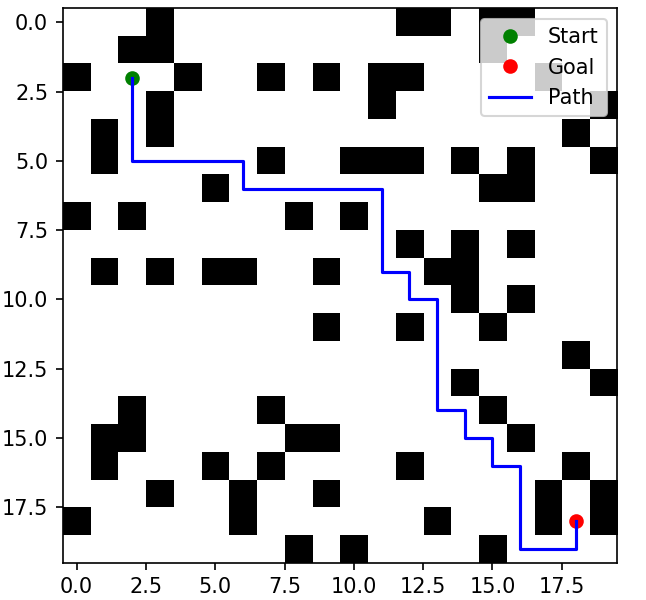

### Fig. 2
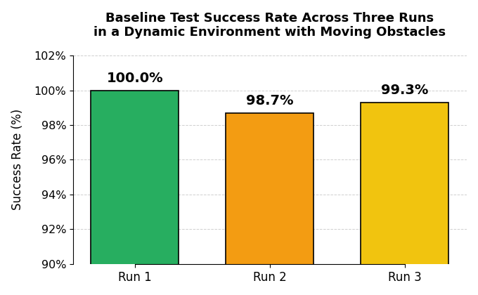

### Fig. 3
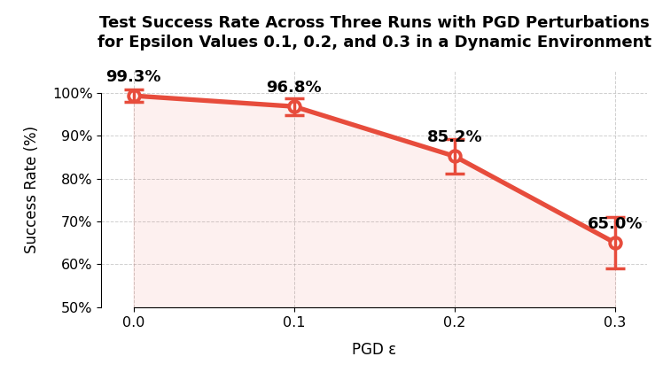

### Fig. 4
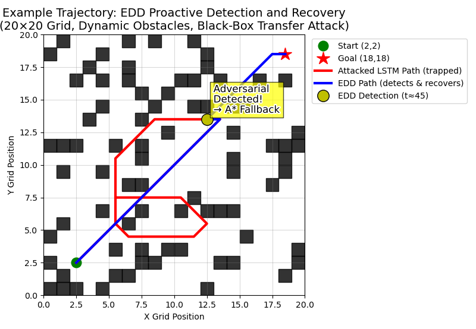

### Fig. 5
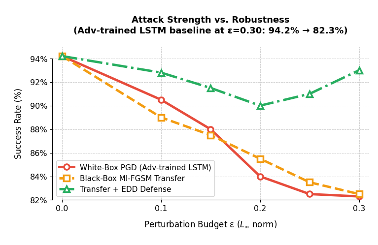

### Fig. 6
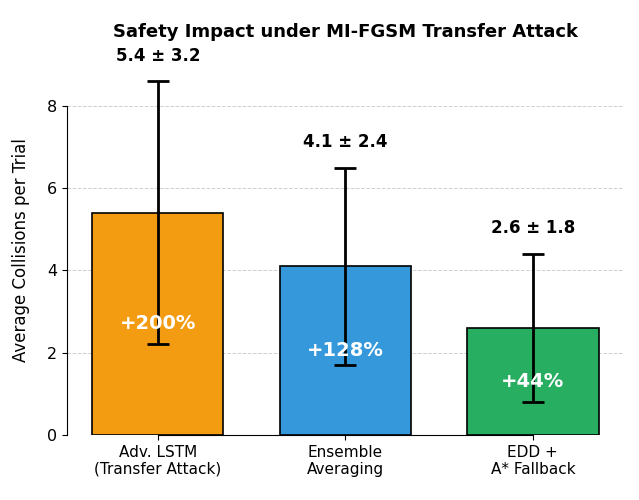

### Fig. 7
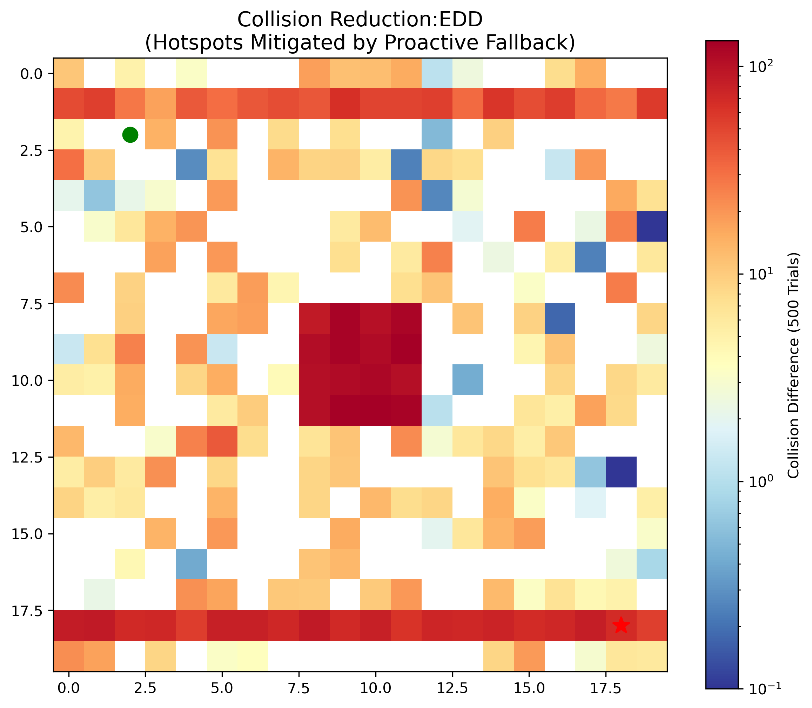

### Fig. 8
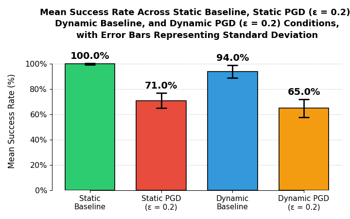

### Fig. 9
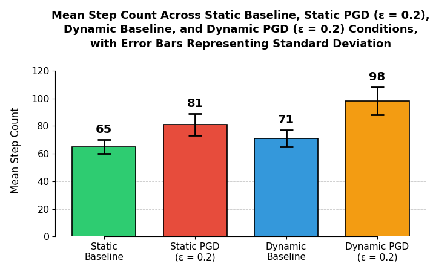

### Fig. 10
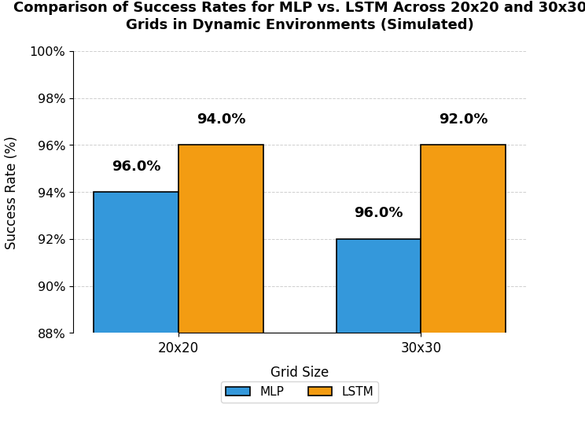

### Fig. 11
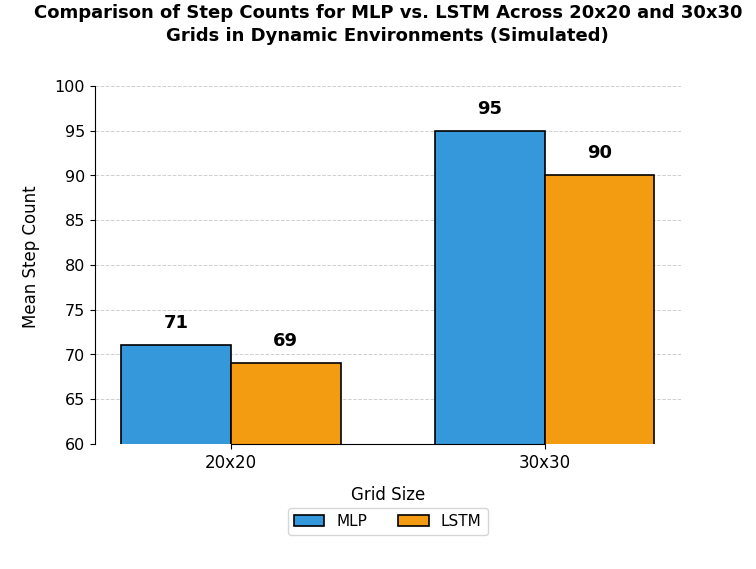

### Fig. 12
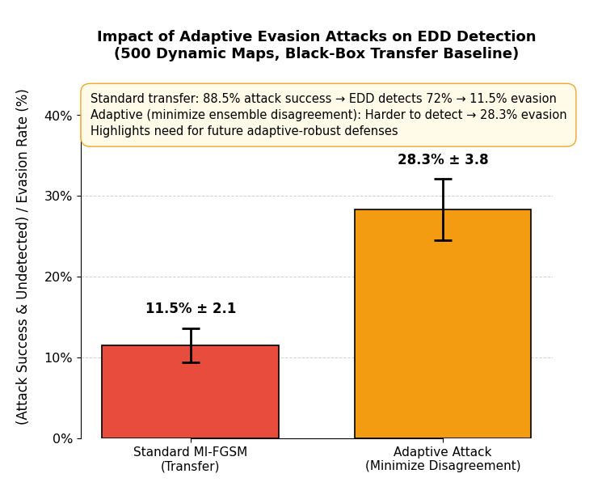

---

## Tables (from the paper)

### Table I — Robust success under full PGD (ε=0.30) for varying LiDAR beam counts
| Beams | MLP Success (%) | LSTM Success (%) |
|------:|-----------------:|-----------------:|
| 8     | 91.4 ± 3.6       | 94.2 ± 2.8       |
| 16    | 93.8 ± 3.1       | 96.1 ± 2.4       |
| 32    | 95.2 ± 2.7       | 97.3 ± 2.1       |

### Table II — Robust success under partial-beam PGD (ε=0.30)
| Attack Type        | k=2   | k=4   | k=6   | Full (k=8) |
|-------------------|------:|------:|------:|-----------:|
| Random subset     | 96.5% | 95.1% | 94.7% | 94.2%      |
| Contiguous sector | 95.8% | 93.9% | 92.6% | 94.2%      |

### Table III — Model size and inference latency
| Model                          | Parameters | Latency (ms/step) |
|-------------------------------|-----------:|-------------------:|
| MLP (baseline)                | 9,731      | 0.12 ± 0.02        |
| LSTM (70 → 64 hidden)         | 51,843     | 0.38 ± 0.05        |
| Wide MLP (approx. 52k params) | 52,099     | 0.21 ± 0.03        |

### Table IV — Robust success under PGD (ε=0.30) with matched capacity
| Model              | Robust Success (%) |
|-------------------|-------------------:|
| MLP (no defense)  | 91.4 ± 3.6         |
| Wide MLP (≈52k)   | 92.6 ± 3.3         |
| LSTM (≈52k)       | 94.2 ± 2.8         |

### Table V — Robust accuracy and efficiency under strong attack
| Model               | Success (%)   | Steps (successful trials) |
|--------------------|--------------:|---------------------------:|
| MLP (no defense)   | 68.1 ± 6.4    | 94 ± 29                    |
| MLP (adv-trained)  | 91.4 ± 3.6    | 72 ± 15                    |
| LSTM (adv-trained) | 94.2 ± 2.8    | 69 ± 14                    |

### Table VI — Average collisions per trial under strongest attack (dynamic env., 500 maps)
| Condition         | Avg. Collisions per Trial |
|------------------|---------------------------:|
| Clean            | 1.8 ± 1.4                  |
| No defense       | 8.7 ± 4.9                  |
| MLP adv-trained  | 3.2 ± 2.1                  |
| LSTM adv-trained | 2.4 ± 1.7                  |

### Table VII — Robust success under PGD for varying LiDAR range (adv-trained, dynamic env., 500 maps)
| Max Range | ε (norm.) | LSTM Success (%) |
|----------:|----------:|-----------------:|
| 10 cells  | 0.30      | 94.2 ± 2.8       |
| 20 cells  | 0.30      | 91.3 ± 3.5       |
| 20 cells  | 0.15      | 95.8 ± 2.9       |

### Table VIII — Collisions per trial under transfer attack (dynamic env., 500 maps)
| Model                  | Avg. Collisions |
|-----------------------|----------------:|
| Adv. LSTM (transfer)  | 5.4 ± 3.2       |
| Ensemble Averaging    | 4.1 ± 2.4       |
| EDD + A* Fallback      | 2.6 ± 1.8      |

### Table IX — Distribution of collisions over trial timeline (% of total in each quartile)
| Condition         | 0–25% | 25–50% | 50–75% | 75–100% |
|------------------|------:|-------:|-------:|--------:|
| Clean (dynamic)  | 28%   | 32%    | 25%    | 15%     |
| No defense       | 12%   | 22%    | 38%    | 28%     |
| MLP adv-trained  | 24%   | 30%    | 29%    | 17%     |
| LSTM adv-trained | 27%   | 33%    | 26%    | 14%     |

---

## Paper
- [Robotics_Paper.pdf](./Robotics_Paper.pdf)
